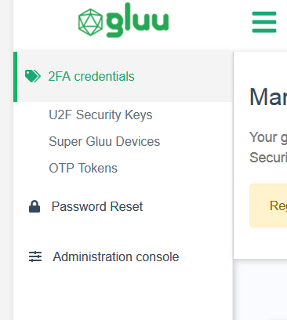

# Coding authentication logic

!!! Important
    Acquaintance with [custom scripts](https://gluu.org/docs/ce/admin-guide/custom-script/) is required in order to handle new authentication methods in Casa. This demands Python and HTML skills. Knowledge of Java Server Faces is a plus.

## Casa workflow    

Casa's authentication workflow consists of a main custom script that determines which authentication methods are currently enabled, dynamically imports the relevant custom scripts and wraps calls to usual flow methods: `prepareForStep`, `authenticate`, `getExtraParametersForStep`, etc. In other words, the Casa script orchestrates the general flow while delegating specific implementation details to other custom scripts.

The Casa custom script supports a flow with backtracking capabilities. If a user is asked to present a specific credential and that credential isn't currently available, he can choose an alternative credential by visiting a different page corresponding to the alternative authentication method. Users can backtrack any number of times.

## Integrating a new method in Casa flow

As mentioned in the [introductory page](./index.md#coding-custom-interception-scripts), to include a custom authentication method, you need a custom script. The method's workflow does not need to handle credential enrollment, it just needs to focus on authentication.

Once you have a working custom script, ensure the following preconditions are met so that it integrates seamlessly within Casa flow :

- For step 1, `prepareForStep` must only return `True`  
- For step 1, `getExtraParametersForStep` must only return `None`  
- For step 1, the `authenticate` routine must check if there is already an authenticated user, and if so bypass validating the username and password. This is because a user may have previously attempted authentication with a different method
- Add a `hasEnrollments` routine with a signature like:
    ```def hasEnrollments(self, configurationAttributes, user):```  
  where the `configurationAttributes` parameter is a `java.util.Map<String, org.xdi.model.SimpleCustomProperty>` with properties specified in `oxConfigurationProperty` attributes, and `user` is an instance belonging to `org.xdi.oxauth.model.common.User` (like the one obtained after a call to `authenticationService.authenticate`).
- `hasEnrollments` must return `True` or `False`, describing whether `user` has one or more credentials enrolled for the type you are interested in  
- Keep in mind that `getPageForStep` won't be called when `step=1` in your script. Casa takes charge of this specific step/method combination  
- Finally, ensure that custom pages returned by `getPageForStep` for step 2 (or higher) include this footer:

```
<ui:include src="/casa/casa.xhtml">
	<ui:param name="methods" value="${identity.getWorkingParameter('methods')}"/>
</ui:include>
```

  This will make the alternative backtracking feasible. This footer includes a set of buttons for the user to navigate to alternate 2FA pages.

## Enabling your method

Once your script is enabled in the oxTrust UI, you can test it for authentication purposes. Casa application is agnostic about the flow itself, so there is no extra work to try your script than creating an authentication request passing `casa` as acr value.

Obviously, you may have to create by hand some entries simulating enrolled credentials (unless you have your plugin for credentials enrollment ready). Actually, to code the plugin you need [such simulated data](./credentials-management.md#credentials-retrieval) at a very early stage of the development.

## Linking plugin and authentication method

Despite the authentication method is enabled in the Gluu Server, it won't be shown in the "enabled methods" section of Gluu Casa [dashboard](../../administration/admin-console.md#enabled-methods). For it to appear there should be at least one plugin implementing enrollment logic for such method. Also, it may take a little while for the method to appear if it has been just enabled in the oxTrust UI.

Once both the script is enabled and at least one plugin installed, a new row will appear in the enabled methods page of admin dashboard showing the respective ACR. Tick the row and select the plugin you created in the selection list and finally hit `Save`. This means you can have several candidate plugins to handle enrollment.

Once you do that, a link for the enrollment page will appear under "2FA credentials" of user's menu:



