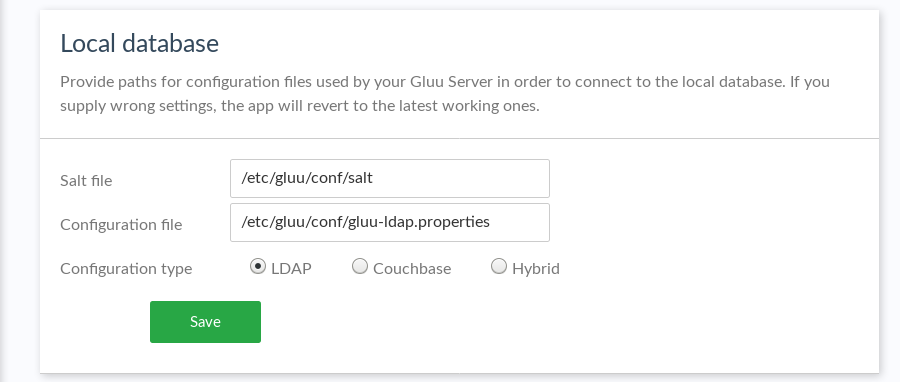
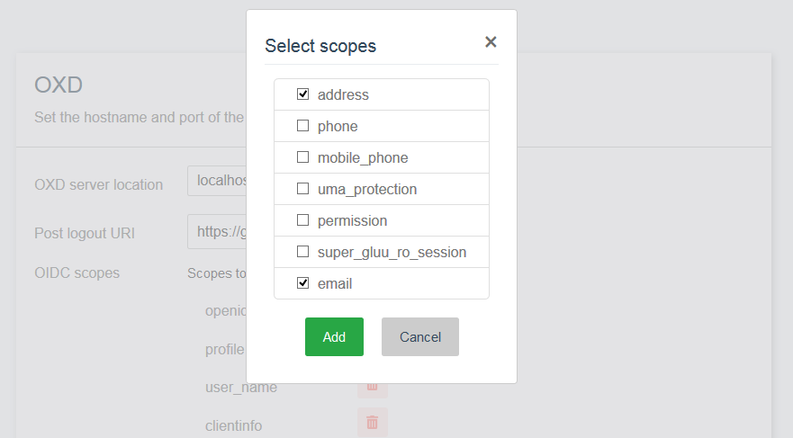
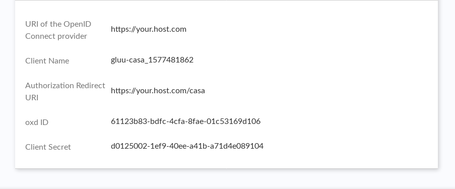
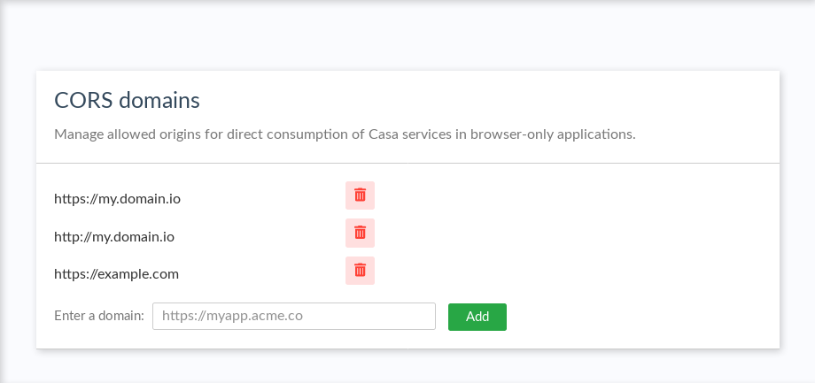

# Admin Console

The sections below document the admin console that is available to Gluu Casa administrators after installation. Many of the settings are configured during initial setup. Once Casa and Gluu are properly configured, follow the [enable methods section below](#enabled-methods) to "turn on" Casa. 

All configuration changes applied via the admin console take effect immediately with no restart or other actions required.

## Local database 

This section contains settings used by Casa to establish a connection to the underlying database. These settings are prepared by the application installer and there is no need to apply any change afterwards. Update these settings only if the application needs to be tested against a different database Server. 

## oxd

Casa leverages [oxd](https://oxd.gluu.org) to faciliate user authentication against its corresponding Gluu Server. oxd installation and configuration is prompted during Casa installation. To change or update details about the oxd server, or to configure and use an existing oxd deployment, navigate to the `oxd` page in the admin console.

!!! Warning
    Ensure your Gluu Server has "dynamic registration" of clients enabled and that "returnClientSecretOnRead" is set to true while you are applying changes here.

    
In case of lockout, visit the [FAQ document](./faq.md#oxd).

### oxd Settings
The following settings can be adjusted or viewed via the Casa admin console:

- oxd server location: host and port of [oxd](https://gluu.org/docs/oxd). 

- Scopes: The scopes to be requested from the authorization server when authentication takes place. Adding scopes to the set of pre-defined scopes allows plugin developers to have access to specific user attributes.

- URI of the OpenID Provider (OP): This is the URL of the corresponding Gluu Server where users are sent for authentication, e.g. `https://idp.myorg.com`. 

- Client Name: The name of the OpenID client that Casa uses to facilitate SSO with the Gluu Server. <!--, e.g. `Casa Production`.-->

- Authorization Redirect URI: This is the URL of the Casa dashboard landing page that users are directed to after authentication. <!--, e.g. `https://idp.myorg.com/credentials`. -->

- Post logout URI: The URL of the page that users should be directed to after they log out of Casa, e.g. `https://myorg.com`. 

- oxd ID: Upon setting up the Casa client, the oxd ID will be automatically generated. It will look something like `2d88f886-0a8e-4249-af46-d47da0481349`

## Enabled Methods

Updates need to be made in both the Gluu Server and Casa to get Casa operational.

### Enable Authentication Scripts (Gluu)

The Gluu Server uses [interception scripts](https://gluu.org/docs/ce/admin-guide/custom-script/) to implement user authentication. For each type of 2FA credential that should be manageable in Casa, the corresponding authentication script **must be** enabled in Gluu. 

To enable authentication methods in Gluu, open oxTrust and navigate to  `Configuration` > `Manage custom scripts`. Enable the interception script for each type of 2FA credential that should be manageable in Casa - i.e. `fido2`, `u2f`, `super_gluu`, `otp`, and/or `twilio_sms`.  

!!! Note
    It is recommended not to use U2F but FIDO2 as authentication method. Visit this [page](./fido2-migration.md) for more information.
    
To confirm script functionality, or if issues arise, check the [troubleshooting doc](./faq.md#troubleshooting-interception-scripts) in the FAQ.

### Set Default Authentication Method (Gluu)
With the Casa authentication script enabled in the Gluu Server, OpenID Connect clients can now request Casa authentication (i.e. each user's 2FA preferences) using the standard OpenID Connect `acr_value`. 

To make this behavior the default for all Gluu logins, navigate to `Configuration` > `Manage Authentication` > `Default Authentication method` and set `Default acr` and `oxTrust acr` to `casa`. Click update to save your changes. 

    
### Configure Casa

Once the applicable interception scripts are enabled in Gluu, a Casa admin can enable 2FA mechanisms in the `Enable methods` interface. Check the box for each type of authentication method users should be able to self-service in Casa. You can assign the handler [plugin](#plugins) for each method. Choose "System" to use the default implementation provided by the application.

!!! Warning
    It may take up to 2 minutes for a method to appear in the enabled methods list of Casa after its corresponding custom script has been activated in oxTrust. 

The System plugin supports several authentication methods:

- OTP SMS
- OTP (handling mobile apps and hard tokens)
- FIDO security keys
- Super Gluu. 

Developers can provide their own [custom handler plugins](https://gluu.org/docs/casa/4.2/developer/authn-methods/) that add or override the authentication methods.

In their home page, users will see widgets for every available method. These widgets are listed in decreasing order of ACR level. That is, the first method shown will be that with the highest level assigned in its corresponding interception script, and therefore the most secure.

!!! Important  
    Once users have enrolled credentials for a specific authentication method (e.g. SMS OTP) in Casa, the administrator cannot deactivate that method.  
    
### Testing 

A recommended practice is to enable one script in the Gluu Server (like U2F), then enable the associated method in Casa. Test and confirm that enrollment and authentication is working as expected, then continue adding other desired 2FA methods. In an incognito browser, employ a user other than `admin` to test enrollments each time a new method is added. This will prevent the `admin` user from being accidentally locked out.

## 2FA settings

!!! Warning  
    This feature is only available through the [2FA settings plugin](../plugins/2fa-settings.md).  

In the 2FA settings, an admin can:

- Specify the minimum number of credentials a user **must** enroll before 2FA can be turned on
- Determine whether 2FA should be automatically enabled upon credential enrollment
- Whether users can turn 2FA on and off their own
- Choose from a few predefined policies for when 2FA should be prompted. 

To reduce the chance of lockouts, we recommend setting a minimum of two (2) strong credentials. 

Predefined 2FA policy options include:

- Enforce strong authentication for every login attempt
- Prompt for 2FA when users' location is unrecognized
- Prompt for 2FA when users' device is unrecognized
- Allow the user to set their own strong authentication policy

The default policy is to enforce 2FA for every login attempt. If the admin opts to allow users to manager their own policy, a new widget will appear in the user-facing dashboard as described in the [user guide](../user-guide.md#2fa-settings--trusted-devices). 

## Pass reset config

If passwords are being stored in the Gluu Server (and not at an external backend directory server like AD), an admin can give users the ability to reset their password from inside Casa. To enable the password reset functionality, navigate to `Pass reset config` and click the toggle to `ON`.  

## Branding

Most organizations will want to custom brand Casa. Follow our guide to learn more about [custom branding Casa](./custom-branding.md).

## Logging

Application logs are useful sources of information to diagnose anomalies and understand possible causes of errors if presented. Casa uses the Log4J2 logging framework for this. The severity level for logs can be modified at runtime and requires no restart. For more information about logging, check the [FAQ entry](./faq.md#where-are-the-logs). 

## Reset to password authentication

If a user is locked out for any reason (e.g. lost device, etc.), an admin can navigate to `Reset to password authentication` in the admin console to turn 2FA off for them. Type the username (or part of) in the text field and then press search. Once the user has been located, click the checkbox and click the `Reset to password` button. The row will become disabled, and a success message will be displayed.

## CORS domains

Casa exposes some REST [services](../developer/rest-services.md) and plugin developers can also add their own. If consumption of services is required from the users' browser, known [cross origin](https://developer.mozilla.org/en-US/docs/Web/HTTP/CORS) problems will arise. To "grant" an external domain access to a Casa service, you can add it to the list of allowed CORS domains.

## Plugins

Plugins are vehicles to augment the functionalities available by default in Gluu Casa. To learn more about plugins, visit the [developer guide](..\developer\index.md#plugins).

In this section of the console, the current list of active plugins is shown. Once an element in the list is selected, a summary of the relevant plugin's metadata is visualized.

Click on the "Add a plugin..." button to select a file in your local hard drive that you wish to onboard as a new plugin into your Gluu Casa installation. Account that plugin files must have a specific format and structure as explained [here](../developer/intro-plugin.md#anatomy-of-a-plugin).

