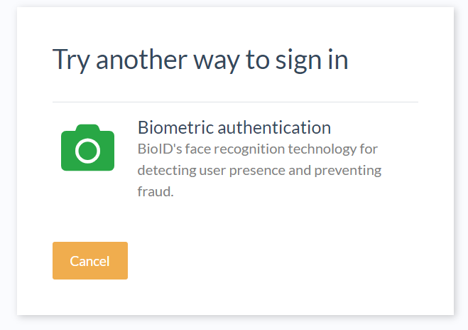

# Integrating BioID's biometric authentication with Casa
  
## Overview
The bioid plugin allows users to enroll their biometric traits (facial and periocular)  and use them as a form of second factor authentication.

## Script configurations

Log into oxTrust, and go to `Configuration` > `Manage Custom scripts` > `bioid`. 
### Script contents

Download this [file](https://github.com/GluuFederation/casa/raw/master/plugins/bioid/extras/BioIDExternalAuthenticator.py) and copy its contents in the `Script` form field.

### Save changes

Click on `Enable` under the script contents box, and press `Update` at the bottom of the page.

## Plugin installation

### Add the plugin to Casa

1. [Download the plugin](https://ox.gluu.org/maven/org/gluu/casa/plugins/bioid/5.0-SNAPSHOT/bioid-5.0-SNAPSHOT.jar)

1. Log in to Casa using an administrator account

1. Visit `Administration console` > `Casa plugins`

    

1. Click on `Add a plugin...` and select the plugin jar file

1. Click on `Add`

Alternatively you can log into chroot and copy the jar file directly to `/opt/gluu/jetty/casa/plugins`.

### Enable the authentication method

Wait for one minute, then visit `Administration Console` > `Enabled methods` and tick `bioid`. On the right, the plugin will be selected by default. Finally save the changes.

## Testing
So far, users that log into Casa should be able to see a new entry "Biometric credentials" that will appear under page will appear under "2FA credentials" .

From there they can enroll their biometric traits. The steps to enroll your facial and periocular traits are self explanatory. Follow the instructions on the web page.

### Use the biometric credential as a second factor
Ensure you have added another credential, hopefully of a different kind, for example a mobile phone number or an OTP token. Then visit the home page and click the toggle to turn 2FA on and logout.
Try to access the application once more and supply the username and password for the account recently used to enroll the biometric credential. Depending on the numeric level assigned to the `bioid` script, you will be prompted for a different factor, for instance, to enter an OTP code. If so, click on `Try an alternative way to sign in` and click on `Biometric credential`.

Follow the instructions on the screen for verification of facial and periocular traits.
Finally you will be redirected and get access to the application.

Note - When you first use BioID you may wish to enroll a few times at different times of days or in different locations under a variety of environmental conditions. Once you can be reliably recognized, you only need to enroll again if something in your face changes significantly (such as after an accident or cosmetic surgery, or if you radically change eyeglasses, facial hair, facial jewelry, etc.) or if you often have to try more than once to be recognized. Once recognized, BioID typically adjusts itself to adapt to the changes right away.
