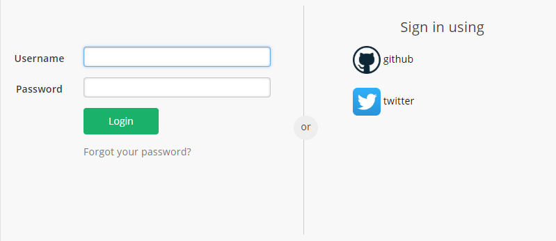
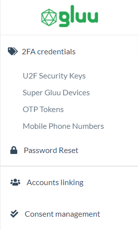

# Accounts Linking
## Overview
This plugin allows users to link accounts used at third-party sites with their local Gluu account. Offer popular social login providers such as Google, Facebook, etc., or even SAML identity providers (IDPs).

## Requirements

- A Gluu Server with the Passport component installed

- The plugin jar file that matches the version of your Casa (and Gluu Server) installation.

- Passport configured to support external providers as needed. Check the Passport docs to learn how to do so: SAML [IDPs](https://www.gluu.org/docs/ce/authn-guide/inbound-saml-passport/) or OAuth/OIDC [providers](https://www.gluu.org/docs/ce/authn-guide/passport/). Make sure to use the version of the docs matching your Gluu Server version.

## Installation

Once you have tested the integration with external providers, you can install the plugin by following the steps below:

1. Log in to Casa using an administrator account

1. Visit `Administration console` > `Casa plugins`

    

1. Click on `Add a plugin...` and select the plugin jar file

1. Click on `Add` 

So far, users will be able to see an "Accounts linking" menu added. From there they can link and unlink accounts while staying inside Casa. The following section describes how to allow users to choose an external provider to log in to Casa and create an account in the Gluu Server (inbound identity).

!!! Note
    When a user logs in for the first time through an external provider, a new user entry is created in the Gluu Server (AKA a local account) linked to the provider. A user won't be able to unlink an account until he sets a password: the plugin bundles a form that allows users to perform this action.

## Alter the authentication flow

These are the steps required so the Casa authentication flow does not require users to enter a username and password combination, but leverages the credentials already existing in an external provider.

### Add custom parameters

Add a custom parameter for authorization requests in your Gluu Server: 

1. In oxTrust go to `Configuration` > `JSON Configuration` > `oxAuth Configuration`

1. Under `authorizationRequestCustomAllowedParameters`, add one item. Choose a name for it, such as `custParamCasaPassport`

1. Press the save button at the bottom of the page

!!! Note
    By default every time a user logs in via a external provider, an update takes place in his profile: all attributes released from the external provider to oxAuth are updated in local LDAP. Attributes not received are flushed. If you don't want the update to take place, please also add a oxAuth custom param with name `skipPassportProfileUpdate`.

### Activate the custom scripts needed

While configuring Passport earlier, you enabled one or more authentication scripts (ie. `passport_social`/`passport_saml`). In oxTrust, navigate to `Configuration` > `Manage custom scripts` and for every script you enabled, add a configuration parameter with name `authz_req_param_provider` and set its value to the custom authorization parameter created earlier (eg. `custParamCasaPassport`).

### Update Casa custom script

Since the *standard* authentication flow will be different, the `casa` script contents must be updated. Expand the row corresponding to Casa script, back up the current script contents and then replace with those found [here](https://github.com/GluuFederation/casa-ee-plugins/raw/version_3.1.6/account-linking/extras/casa.py).

Press the update button at the bottom of the page.

The login page must be updated so it dynamically loads the external providers in a way that users can choose a provider to log in/create an account:

1. Log in to the chroot
1. `cd` to `/opt/gluu/jetty/oxauth/custom/pages`
1. Copy the file found [here](https://github.com/GluuFederation/casa-ee-plugins/raw/version_3.1.6/account-linking/extras/casa.xhtml) into `pages` folder.

## User guide

Access Casa in a web browser: `https://your-host.com/casa`. A list with the configured providers should be shown on the right panel.

Clicking on an item will take you to the given provider's authentication process. After this is finished, you will be taken back to Casa.

Note that users without a local password set yet don't have access to enroll credentials because the username + password combination is  a prerequisite for multi-factor authentication. The user will be prompted to create a new password.

Alternatively, if a user is already logged in, they can navigate to Account Linking on the left-hand menu.

This presents the option to link new accounts, or edit existing linked accounts.

Once an account is linked, it can be disabled or removed by pressing the appropriate button.

