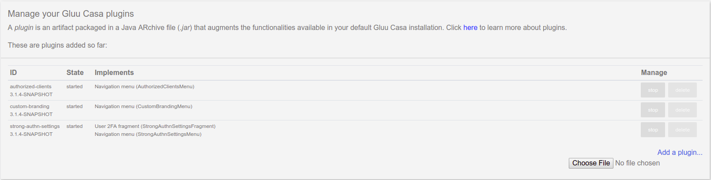

# Integrating browser certificate authentication with Casa

## Overview
The browser certificate plugin allows users to enroll X.509 digital certificates and use them as a form of second factor authentication.

## Script configurations

A special custom script is key for this plugin. It serves as mechanism to incorporate the browser certificate prompt into Casa authentication flow and also to hold parameters for the plugin itself.

!!! Note:
    If for some reason you are already using the `cert` script, please back up its contents now.

Log into oxTrust, and go to `Configuration` > `Manage Custom scripts` > `cert`. Script contents and config must be tailored for Casa:

### Script contents

Download this [file](https://github.com/GluuFederation/casa/raw/master/plugins/cert-authn/extras/cert-authn.py) and copy its contents in the `Script` form field.

### Certificate authority (CA) cert

The property `chain_cert_file_path` should point to a file in PEM format with the chain of CA certificates. The [testing](#testing) sections offers an example of how to generate a simple CA cert.

### Validators

When web browsers prompt users to choose a certificate, a number of validations take place on the certificate selected. Admins can parameterize the validations desired. For this purpose, set a value of `true` for the property you are interested in:

|Property|Validator|Description|
|-|-|-|
|use_generic_validator|Period validator|Checks if the cert would be valid at the given time of usage using cert's `notAfter`/`notBefore`|
|use_path_validator|Chain validator|Verifies the cert using the certification chain|
|use_crl_validator|Certificate revocation list validator (CRL)|Uses [CRL](https://en.wikipedia.org/wiki/Certificate_revocation_list) for verification|
|use_ocsp_validator|Online Certificate Status Protocol (OCSP) validator|Uses OCSP responder servers to check cert validity|

### Other properties

Certificate revocation list validation imposes certain overhead so it is necessary to cap the maximum size of data to be downloaded. This can be controlled using `crl_max_response_size` property. If not supplied, default value is 5MB.

Both `credentials_file` and `map_user_cert` properties are not in use, you can leave them as is, or entirely remove them.

### Save changes

Click on `Enable` under the script contents box, and press `Update` at the bottom of the page.

## Custom pages

The configured script requires a custom page. Do the following:

1. Login to chroot and run:
1. `cd /opt/gluu/jetty/oxauth/custom/pages`
1. `mkdir casa && cd casa`
1. `wget https://github.com/GluuFederation/casa/raw/master/plugins/cert-authn/extras/cert.xhtml`

## Apache configuration

!!! Note:
    Using containers? please open a support ticket if your server is ngnix.
    
Locate Gluu's Apache configuration file `https_gluu.conf` in chroot and find the `SSLVerifyClient` directive. Duplicate the whole `LocationMatch` directive changing the first line this way:

```
<LocationMatch /casa/pl/cert-authn/index.zul>
```

Save the file and restart Apache.


## Plugin installation

<!- 
Besides installing the client certificates plugin in Casa, the following configurations must be performed in order to properly integrate those in the authentication flow of Casa. -->

### Add the plugin to Casa

1. [Download the plugin](https://ox.gluu.org/maven/org/gluu/casa/plugins/cert-authn/4.2.Final/cert-authn-4.2.Final.jar)

1. Log in to Casa using an administrator account

1. Visit `Administration console` > `Casa plugins`

    

1. Click on `Add a plugin...` and select the plugin jar file

1. Click on `Add`

Alternatively you can log into chroot and copy the jar file directly to `/opt/gluu/jetty/casa/plugins`.

### Enable the authentication method

Wait for one minute, then visit `Administration Console` > `Enabled methods` and tick `User certificate`. On the right, the plugin will be selected by default. Finally save the changes.

## Testing

So far, users that login to Casa should be able to see a new "User certificates" menu item. From there they can "link" their certificates. It is important to note that actual certificates have to be **imported directly** in the browser beforehand. There are hints in the UI in this regard. The sample applies for "delinking".

Once a certificate is added, and if 2FA is turned on for the user, the browser will prompt to select a certificate after the usual username and password combination is supplied. In this sense, the certificate will just act as a second factor.

Note that only certificates already added via Casa can be used for authentication. Any other imported certificates selected in the browser will fail for authentication regardless of their validity.

In the following we describe simple steps to quickly test the plugin and the authentication flow:

### Generating CA certs

You can sign client certificates with a self-signed cert, for instance you can do:

```
openssl req -newkey rsa:4096 -keyform PEM -keyout ca.key -x509 -days 365 -outform PEM -out ca.cer
```

And then copy `ca.cer` to a location that you should specify in `chain_cert_file_path` property of the script.

TODO
