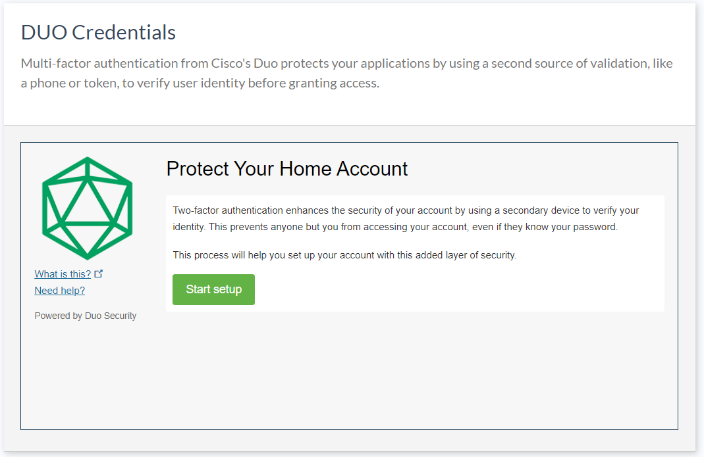

# Integrating Duo's 2fa credentials with Casa

## DUO's MFA Service
Multi-factor authentication from [Cisco's Duo](https://duo.com/) protects your applications by using a second source of validation, like a phone or token, to verify user identity before granting access. Duo is engineered to provide a simple, streamlined login experience for every user and application, and as a cloud-based solution, it integrates easily with your existing technology.

This document will explain how to use Gluu's [Duo interception script](https://github.com/GluuFederation/casa/blob/version_4.2.2/plugins/duo/extras/DuoExternalAuthenticator.py) along with a Plugin in Casa to enroll a user's DUO credentials for 2FA. 

In order to use this authentication mechanism your organization will need to register for a DUO account. 

## Prerequisites
- A Gluu Server ([installation instructions](../installation-guide/index.md));
- [DUO interception script](https://github.com/GluuFederation/casa/blob/version_4.2.2/plugins/duo/extras/DuoExternalAuthenticator.py) ;
- An account with [DUO](https://admin.duosecurity.com/).   

## Configure DUO Account

#### A. [Sign up](https://admin.duosecurity.com/) for a DUO account.

#### B. Setting up DUO Web SDK:
1. Make the necessary configurations so as to be able to add Duo's strong two-factor authentication to your web application, complete with inline self-service enrollment and Duo Prompt(iframe which enables login and enrollment). The steps are [here] (https://duo.com/docs/duoweb)
2. Generate an akey. You'll find steps for the same in this [document](https://duo.com/docs/duoweb) under "Instructions".
3. Note that Integration key (ikey), Secret key (skey) and akey (generated from step b.) will be used in /etc/certs/duo_creds.json in the Gluu server.
4. Note that API hostname will be used in Gluu's interception script as property "duo_host"
5. Enable the Self-Service Portal - https://duo.com/docs/self-service-portal
	
#### C. Setting up Admin API:
1. The required role to access the Admin API is Duo "Owner" level Administrator, further details to enable the role is [here](https://duo.com/docs/adminapi#first-steps). More information to the different administrator roles are [here] (https://duo.com/docs/administration-admins#duo-administrator-roles). To get access to this tab, please ask any of the other admins on the account to raise your role to owner level.
2. Note that ikey, skey of Admin API  will be used in /etc/certs/duo_creds.json in the Gluu server under the name admin_api_ikey and admin_api_skey
   

## Script configurations

Log into oxTrust, and go to `Configuration` > `Person Authentication scripts` > duo. 
### Script contents

Download this [file](https://github.com/GluuFederation/casa/blob/version_4.2.2/plugins/duo/extras/DuoExternalAuthenticator.py) and copy its contents in the `Script` form field.

### Properties
The mandatory properties in the DUO authentication script are as follows

|	Property	|Status		|	Description	|	Example		|
|-----------------------|---------------|-----------------------|-----------------------|
|duo_creds_file		|Mandatory     |Path to ikey, skey, akey|/etc/certs/duo_creds.json|
|duo_host		|Mandatory    |URL of the Duo API Server|api-random.duosecurity.com|

### Contents of duo_creds_file as configured in Properties 
1. Here is a sample file - https://github.com/GluuFederation/casa/blob/version_4.2.2/plugins/duo/extras/duo_creds.json
2. The contents of the file can be populated by referring to Step B and C under "Configure DUO Account"

### Save changes

Click on `Enable` under the script contents box, and press `Update` at the bottom of the page.

## Plugin installation

### Add the plugin to Casa

1. [Download the plugin](https://ox.gluu.org/maven/org/gluu/casa/plugins/duo/4.2.2-SNAPSHOT/duo-plugin-4.2.2-SNAPSHOT.jar) 

1. Log in to Casa using an administrator account

1. Visit `Administration console` > `Casa plugins`

1. Click on `Add a plugin...` and select the plugin jar file

1. Click on `Add`

Alternatively you can log into chroot and copy the jar file directly to `/opt/gluu/jetty/casa/plugins`.

### Enable the authentication method

Wait for one minute, then visit `Administration Console` > `Enabled methods` and tick `duo`. On the right, the plugin will be selected by default. Finally save the changes.

## Testing
So far, users that log into Casa should be able to see a new entry "DUO credentials" that will appear under "2FA credentials" .

The steps to enroll your DUO credentials are self explanatory. Follow the instructions on the web page.
You can modify your enrollments or delete your credentials by visiting your registered credential.

### Use the duo credential as a second factor
Ensure you have added another credential, hopefully of a different kind, for example a mobile phone number or an OTP token. Then visit the home page and click the toggle to turn 2FA on and logout.
Try to access the application once more and supply the username and password for the account recently used to enroll the duo credential. Depending on the numeric level assigned to the `duo` script, you will be prompted for a different factor, for instance, to enter an OTP code. If so, click on `Try an alternative way to sign in` and click on `DUO credential`.

Follow the instructions on the screen for verification duo credentials.

Finally you will be redirected and get access to the application.

