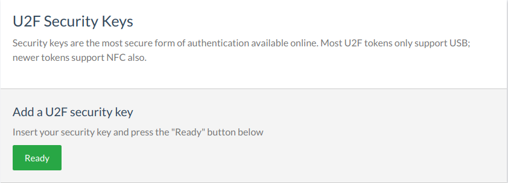
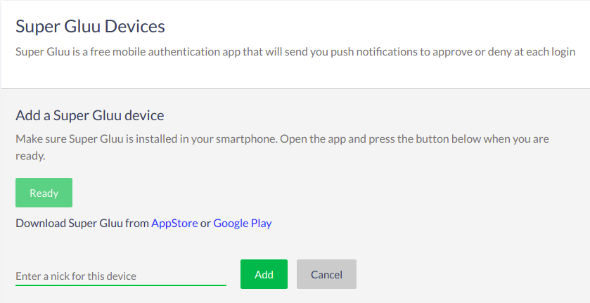
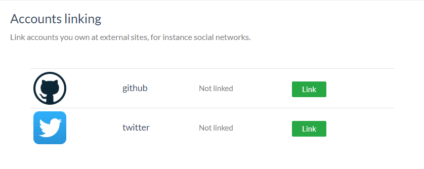
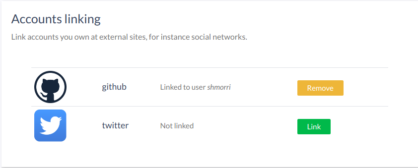

# User Guide - Gluu Casa

## Overview

Gluu Casa ("Casa") is a self-service web portal for end-users to manage security preferences for their account(s) in a Gluu Server. 

The primary use-case for Casa is self-service 2FA. Other use cases and functionalities can be supported via [Casa plugins](https://casa.gluu.org/plugins), for example [Account Linking](#account-linking) and [Consent Management](#consent-management). 

!!! Note
    The options displayed in the user portal will always depend upon which settings have been enabled by the administrator. 

## Sign in for the first time

To log in to Casa, navigate to `https://<yourdomain>/casa`.

Sign in with your standard username and password. If you do not have an account but social login is enabled, you can create a new account via social login. 

## Credential Dashboard

The credential dashboard displays widgets for each type of supported 2FA credential (e.g. U2F keys, OTP apps, etc.). Each widget includes summary details of enrolled credentials and a button to manage credentials for your account.

## Enroll 2FA credentials

Click the `Manage` button for any supported type of 2FA to enroll that type of credential. 

For example, if you have an OTP authentication app, like Google Authenticator, click the `Manage OTP tokens` button and follow the instructions below to [enroll an OTP token](#otp-tokens). 

If you have a FIDO key, click the `Manage Security Keys` button and follow the instructions below to [enroll your key](#u2f-security-keys):

Upon clicking the `Manage...` button, you will be redirected to a dedicated page where you can add, delete, and manage your devices for that type of 2FA. 

!!! Note 
    When a credential is deleted, it cannot be recovered. You will need to re-enroll the credential. Deleting credentials may result in 2FA being turned off. 

### U2F security keys

To add a new U2F credential, navigate to `2FA credentials` > `U2F Security Keys`. Insert your U2F key in your computer and click`Ready`. Casa will prompt you to press the button on your U2F key.

Casa will now prompt you to add a nickname for the credential. Give it a recognizable name, and click `Add`

Once complete, the new device will appear in a list on the same page. Click the pencil to edit the device's nickname, or the trashcan to delete the device.

    
### Super Gluu Devices

To add a new Super Gluu device, navigate to `2FA credentials` > `Super Gluu Devices`.

Click `Ready` and an enrollment QR code will pop up. Scan it with your Super Gluu app and approve the enrollment in the app.

Casa will now prompt you to add a nickname for the credential. Give it a recognizable name, and click `Add`

Once complete, the new device will appear in a list on the same page. Click the pencil to edit the device's nickname, or the trashcan to delete the device.

### OTP Tokens

To add a new OTP token, navigate to `2FA credentials` > `OTP Tokens`.

#### Soft tokens 

To add a soft OTP token, e.g. a mobile app like Google Authenticator, click the radio dial for `Soft token`. 

Click `Ready` and an enrollment QR code will pop up. Scan it with your OTP mobile app. Casa will now prompt you to enter the OTP from your mobile app. Confirm it, then give the credential a nickname. 

#### Hard tokens
For a hard token, choose the `Hard Token` option.

Add the key associated with the device and the 6 digit code. Add a nickname for the device and click `Add`.

Once it's added, the new device will appear in a list on the same page. Click the pencil to edit the device's nickname or the trashcan to delete the device.

### Mobile Phone Numbers

To add a new mobile phone number for one-time passcodes, navigate to `2FA credentials` > `Mobile Phone Numbers`.

Enter a phone number and click 'Send SMS' to get the passcode. Enter the code received, nickname the mobile number, and click `Add`.

Once it's added, the new mobile number will appear in a list on the same page. Click the pencil to edit the mobile number's nickname or the trashcan to delete the mobile number.

## Enforcing 2FA

### Turn on 2FA
After the minimum number of 2FA credentials have been enrolled (as specified by the system admin -- typically two), a new widget will appear on your dashboard to manage your preferred authentication mechanism. 

Click the pencil icon in the preferred credential widget, and selecting one of your enrolled 2FA mechanisms as your preferred 2FA mechanism: 

Choose your preferred 2FA option. Click `Update` to save your settings. 

Now, when prompted for 2FA, the preferred credential will be requested _first_. If the preferred credential is unavailable, any other previously enrolled 2FA credential can be used instead. 

 

### Turn off 2FA

To turn off 2FA, simply set the preferred credential back to password. 

### 2FA settings & trusted devices
If enabled by the system administrator, you can set your own policy for when 2FA should be enforced. 

To set your 2FA policy, after enrolling and turning 2FA on, click the `Manage your 2FA settings` button in the Preferred Authentication Mechanism widget. 

You will be able to choose from a few pre0defined options for when 2FA is presented:

- Always (upon every login attempt)
- If the location (e.g. city) detected in the login attempt is unrecognized
- If the device used to login is unrecognized

If you opt for 2FA based on location, device, or both, a new widget will appear to display your trusted devices. 

### 2FA best practices

The context of an authentication attempt can determine which type of credental is most convenient to use. For instance, U2F keys are not compatible with mobile phones or non-Chrome browsers. 

**To reduce the chance of account lockout**, enroll at least two different _types_ of 2FA credentials -- e.g. one U2F token and one OTP app; or one OTP app and one SMS phone number, etc. This way, regardless which device you're using to access a protected resource, you will have a usable option for passing strong authentication. 
    
## Password Reset

If enabled by the system administrator, Casa can also be used to change your password. 

Navigate to the `Password Reset` widget. Enter your current and new passwords, then click `Change password`.

    
## Account linking

To manage accounts linked to outside sources, navigate to `Account Linking` on the left-hand menu.

This presents the option to link new accounts, or edit existing linked accounts.

Once an account is linked, it can be removed when necessary.

### Sign in with a linked account

If the administrator has enabled the Account Linking plugin, a list with the configured providers will be displayed on the right panel. Click on an entry to access the given provider's authentication process. After this is finished, you will be taken back to Casa.

Note that users without a local password set yet don't have access to enroll credentials because the username + password combination is  a prerequisite for multi-factor authentication. The user will be prompted to create a new password.

## Consent Management

If the administrator has enabled the `Consent Management` plugin, it will appear in the navigation menu for all users. 

New entries are added automatically whenever the user is prompted for, and authorizes the release of their personal data to an application accessed using their Gluu account.   

### Revoking consent
When a previously granted consent decision is revoked, the user will be re-prompted to authorize release of their data if/when they attempt to access the application again. 
